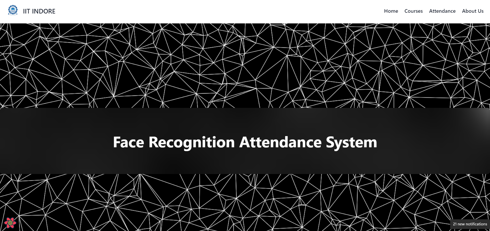

# Facial Recognition Attendance System - IIT INDORE
A Web and App Powered System for Attendance<br>



## Team Details
- Pradeep Kumar Rebbavarapu (220001058)
- Vijit Balsori (220001079)
- Panchangam Akhilesh (220001053)

# Running the App locally

> Prerequisites: <a href = "https://nodejs.org/en/" target = "blank"> Node.js </a>, <a href = "https://git-scm.com/" target = "blank"> Git </a>, [Django](https://djangoproject.com/), [Python](https://python.org/downloads/), [Docker](https://docs.docker.com/engine/install/) and [Redis](https://redis.io/docs/install/install-redis/).

- Clone this repository using the following command:
    ```git clone https://github.com/Pradeep-Kumar-Rebbavarapu/Face-Recognition-Attendance-System```

## Setting up the Backend

  * ```cd server```
  * ```python -m venv venv```
  * ```venv\Scripts\activate```
  * ```pip install tensorflow --no-cache-dir```
  * ```pip install -r requirements.txt --no-cache-dir```
  * ```pip install aws-shell --no-cache-dir```
  * ```pip install boto3 --no-cache-dir```
  * ```pip install celery --no-cache-dir```
  * ```sudo apt-get install -y libgl1-mesa-glx```
  * ```python manage.py makemigrations```
  * ```python manage.py migrate```
  * ```python manage.py runserver```
## Setting up Celery Worker
  * ```celery -A server.celery worker --pool=solo -l INFO```
  * make sure your BASE_DIR is /server
## Running Redis as a Docker Image
  * ```docker run --publish=6379:6379 redis```
  * you would need docker desktop on windows to run the above command
## Setting Up AWS Services
  * ```aws configure```
  * it will ask you for your access key and password - get it from aws console

## Setting up the Frontend

  * ```pnpm i --force``` or ```npm install --force```
  * ```npm run dev``` or ```pnpm dev```
  * Open ```https://localhost:8000``` or the link that appears in the terminal in any web browser. Local deployment complete.

# Features

## upload and capture photo using a webcam
  * professors can upload a class photo / capture the photo at that very instant and collect the attendance .
<hr>

## PWA(Progressive Web Application) Support
  * Our Website is Also Available as An App . It can run on both android and IOS . 
<hr>

## Downloadable Attendance in Excel Format
  * Attendance can be downloaded In an excel format for a single day
<hr>


  * Students can View Their Attendance and Raise any Query 
<hr>

## [Google Colab](https://colab.research.google.com/drive/1SPunPLtSqpu0fH095WPzA7KNVarKm4Td#scrollTo=70bSHvI0jIBl)
